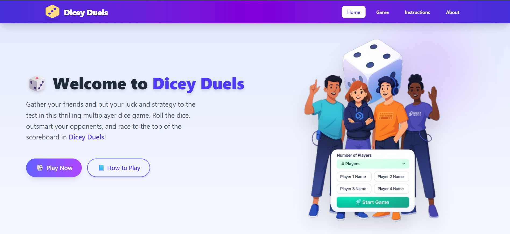
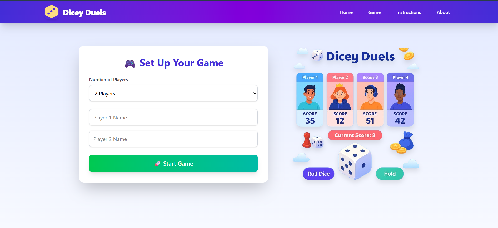
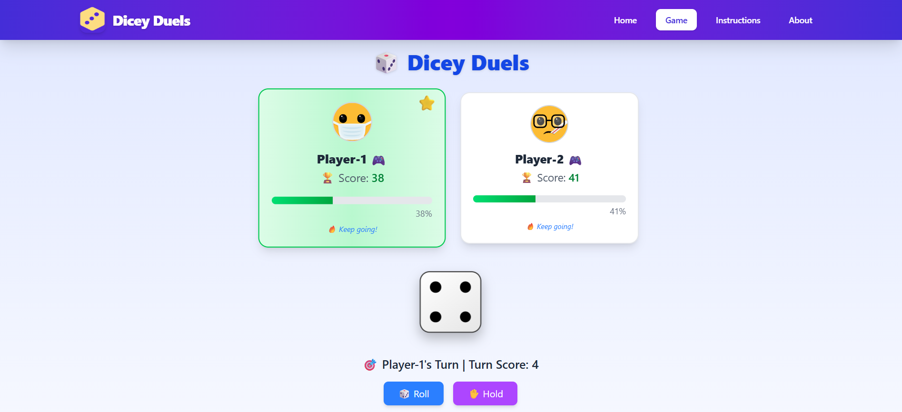

# 🎲 **Dicey Duels**

**Dicey Duels** is a dynamic **multiplayer dice game** where 2 to 4 players compete to be the first to **reach 100 points**. With glowing effects, smooth transitions, and real-time gameplay, it's the perfect quick-fire challenge among friends.

> Built using **React.js**, **Tailwind CSS**, and **Framer Motion**, Dicey Duels brings intense, strategic dice duels with slick animations and responsive design.

---

## 🌟 **Key Features**

- 👥 **Multiplayer Mode** — Choose between 2, 3, or 4 players before starting the game.
- 🎯 **Race to 100** — First player to reach **100 points** wins the duel.
- 🎲 **Animated Dice Rolls** — Realistic dice roll animations using Framer Motion.
- 🧠 **Turn Management** — Active player is highlighted; turns rotate automatically.
- 🏆 **Victory Screen** — Celebrates the winner with animated glow and effects.
- 🔁 **Reset & Home Controls** — Easily restart or return to the home screen.
- 📱 **Responsive UI** — Fully mobile-optimized layout.
- ⚛️ **Component-Based Structure** — Reusable and modular code design.

---

## 🛠️ **Tech Stack**

| Layer        | Technologies                           |
|--------------|----------------------------------------|
| **Frontend** | React.js (Vite), Tailwind CSS          |
| **Animations** | Framer Motion                        |
| **Icons**    | React Icons (Lucide, FontAwesome)      |

---

## 🚀 **Getting Started**

###  1. Clone the Repository
```bash
git clone https://github.com/abhishek5703/dicey-duels.git
cd dicey-duels
```
### 2. Install Dependencies
```bash
npm install
```
### 3. Run the App
```bash
npm run dev
```
Visit: http://localhost:5173

## 🧪 How to Play
```bash
🎮 Select the number of players (2, 3, or 4) on the home screen.

🎲 Each player takes turns clicking their dice to roll.

➕ Dice value is added to the player's score.

🔁 Turns rotate automatically among all players.

🏁 First player to reach 100 points wins the game.

🔄 Use the reset button to start a new round!
```

## 📸 Demo Screenshots

### 🏠 Home Screen  
It is the home screen of the game 


---

### 🧍 Multiplayer Game Screen  
Choose number of players before starting. 


---

### 🏆 Game Score Highlights  
Shows the live score of the players and their status  



## 🤝 Contributing
Pull requests are welcome!

To contribute:

1. Fork the repo

2. Create a new branch
```bash
git checkout -b feature-name
```
3. Commit your changes

4. Push to your fork

5. Open a pull request
   
For major changes, please open an issue first.

## 📬 Contact  
**Developer:** Abhishek Kumar  
📧 **Email:** abhikumar898307@gmail.com  
🌐 **GitHub:** [github.com/abhishek5703](https://github.com/abhishek5703)  
💼 **LinkedIn:** [linkedin.com/in/abhishekkumar8983](https://linkedin.com/in/abhishekkumar8983)


